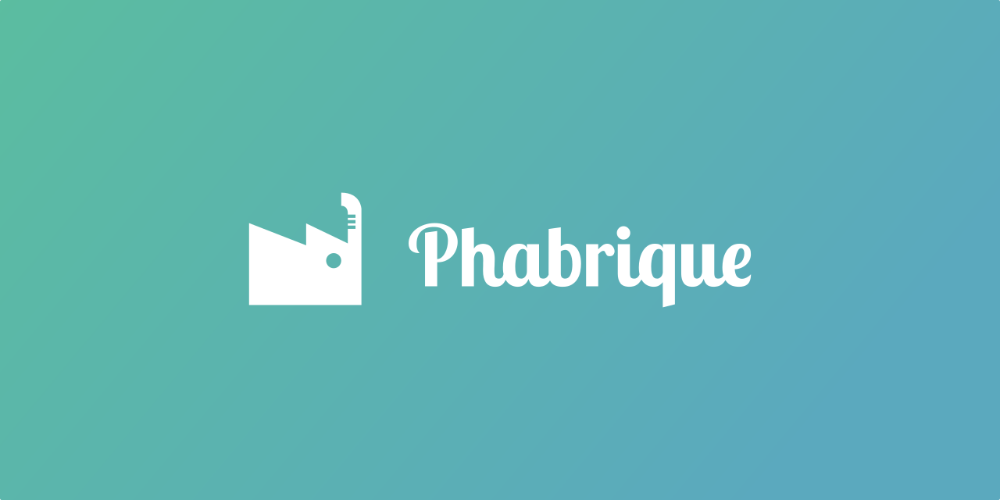

## About Phabrique

Phabrique is a PHP web framework which main purpose is to minimize dependencies while providing a straightforward and easy to use set of tools for web development. It's core principles center around minimalism and extensibility.

- **Minimalism**: Phabrique aims at being a minimalist library, it only provides tools related to request management.
- **Extensibility**: Designed for being extended, it heavily relies on external libraries for more complex use cases.

## Features

Phabrique provides a simple, but powerful set of built-in features:

- **Routing**: An efficient router maps http requests to your controllers and routes. 
- **Request/Response management**: Robust request and response object for easy access to headers, data, and HTTP status.
- **Middleware**: A simple middleware system for adding behaviour before/after the request management.

## Installation

Phabrique is not yet available on Packagist. However, it can still be installed via **Composer**, starting with PHP 8.3 or newer. For that you'll need to enable VCS in your `composer.json` as

```jsonc
{
  "require": {
    "mbs/phabrique": "dev-master" // Latest release
  },
  "repositories": {
    "mbs/phabrique": {
      "type": "vcs",
      "url": "https://github.com/MechanicalBeerSoftware/phabrique"
    }
  }
}
```

After adding the package to the `composer.json`, it can be installed using the regular composer command

```bash
composer install
```

## Contributors

- [Polifev](@polifev)
- [Deimort](@deimort)
